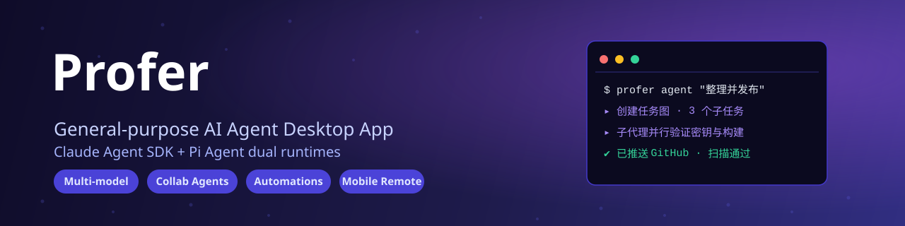

<div align="center">



# Profer

**General-purpose AI Agent Desktop App built on Claude Agent SDK**

Multi-model · Collaboration Sub-Agents · Scheduled Automations · Tablet Remote Access · Team Workspaces

[](https://github.com/Yuan-lai-ru-ci/ProferAI/releases)
[](./LICENSE)
[](https://www.electronjs.org/)
[](https://github.com/anthropics/claude-agent-sdk)
[](https://www.typescriptlang.org/)
[](https://github.com/Yuan-lai-ru-ci/ProferAI)
[](https://github.com/Yuan-lai-ru-ci/ProferAI/pulls)

</div>

---

Profer is a local-first AI desktop app: **use Chat for simple questions, hand complex tasks to Agent**. On top of a powerful local AI agent, it adds a team collaboration layer — personal + team workspaces, a Skills marketplace, cloud file sync, and invite-only member management. Team knowledge lives in workspaces instead of being lost in conversations.

---

## ✨ Key Features

| Feature | Description |
| --- | --- |
| 🤖 **General-purpose Agent** | Built on `@anthropic-ai/claude-agent-sdk` — task graphs, dependency-ordered subtasks, streaming output, plan confirmation, with **Claude / Pi dual runtimes** |
| 🧩 **Collaboration Sub-Agents** | Split complex tasks across real parallel sub-sessions, each advancing independently, then aggregate results — fully visible and trackable |
| ⏰ **Scheduled Automations** | Durable scheduling (interval / daily / weekly / monthly) with run history, failure protection, and retrospection — ideal for reports, periodic checks, unattended workflows |
| 📱 **Tablet Remote Access** | Capacitor + Android client connects to the desktop via local HTTP/WS — tablet chat, synced settings, auto-reconnect |
| 👥 **Team Workspaces** | Invite-only teams (Owner / Admin / Member / Viewer roles), Skills marketplace, cloud file sync, brand customization |
| 💬 **Multi-model Chat** | Multi-provider conversations, attachments (PDF / Office / images), Markdown / Mermaid / KaTeX / syntax highlighting, side-by-side compare, context management |
| 🧠 **Skills & MCP** | Per-workspace Skills and MCP servers, fullscreen skill view with search, enable, update, import, uninstall, and team publishing |
| 🔌 **Remote Bots** | Feishu / Lark / DingTalk / WeChat bridges — trigger local agent workflows from your phone or group chat |
| 🎨 **Desktop Experience** | Auto-update, global shortcuts, quick task window, streaming voice input (Doubao), light / dark / multiple curated themes |

---

## 📸 Screenshot


---

## 🚀 Quick Start

### Download

Get the latest release from [GitHub Releases](https://github.com/Yuan-lai-ru-ci/ProferAI/releases). Builds are provided for **macOS Apple Silicon / Intel** and **Windows**.

### First-run Setup

1. Launch Profer and complete the environment check (Agent mode depends on Git, Node.js / Bun, and a usable shell)
2. **Settings → Model Config**: add AI providers (Anthropic, DeepSeek, Kimi, Zhipu, Doubao, Qwen, etc.)
3. **Settings → Agent Config**: pick your default provider, model, and workspace — you're ready to go

### Optional: Team Server

Team features need the backend service (lightweight Hono + SQLite, deployable to any Linux server):

```bash
git clone https://github.com/Yuan-lai-ru-ci/ProferAI.git
cd ProferAI/server
npm install
nohup node index.js > server.log 2>&1 &
```

Then configure the team server address in **Settings → Branding** to invite members, share Skills, and sync files.

---

## 🤖 Supported Providers

| Provider | Chat | Agent | Protocol |
| --- | --- | --- | --- |
| Anthropic | ✅ | ✅ | Messages API |
| DeepSeek | ✅ | ✅ | Anthropic-compatible |
| Kimi API | ✅ | ✅ | Anthropic-compatible |
| Kimi Coding Plan | ✅ | ✅ | Anthropic-compatible (officially whitelisted) |
| OpenAI | ✅ | ❌ | Chat Completions |
| Google | ✅ | ❌ | Gemini API |
| Zhipu AI | ✅ | ✅ | Anthropic-compatible |
| MiniMax | ✅ | ✅ | Anthropic-compatible |
| Doubao | ✅ | ✅ | Anthropic-compatible |
| Qwen | ✅ | ✅ | Anthropic-compatible |
| Custom Endpoint | ✅ | ❌ | OpenAI-compatible |

---

## 🛠️ Tech Stack

| Layer | Technology |
| --- | --- |
| Runtime | Bun |
| Desktop | Electron 43 |
| Frontend | React 18 + TypeScript + Jotai |
| Styling | Tailwind CSS + Radix UI |
| Rich text / charts | TipTap · Beautiful Mermaid · KaTeX · Shiki |
| Build | Vite + esbuild + electron-builder |
| Agent SDK | `@anthropic-ai/claude-agent-sdk@0.3.201` |
| Tablet | Capacitor (Android) |
| Team backend | Hono + better-sqlite3 + JWT |

---

## 👷 Development

Bun workspace monorepo:

```text
profer/
├── packages/
│   ├── shared/         # shared types, IPC constants, config
│   ├── core/           # Provider Adapters, SSE, code highlighting
│   ├── project-core/   # project / workspace domain models
│   ├── session-core/   # session domain models
│   └── ui/             # shared React UI components
├── apps/
│   ├── electron/       # Electron desktop app
│   └── cli/            # command-line tools
├── server/             # team sync backend (Hono + SQLite)
└── tablet-app/         # tablet remote client (Capacitor Android)
```

```bash
bun install        # install dependencies
bun run dev        # dev mode (Vite + Electron + HMR)
bun run typecheck  # type checking
bun test           # tests
```

---

## 🤝 Contributing

PRs welcome! Before submitting:

- Use Bun — do not mix npm / pnpm lockfiles
- State management uses Jotai
- TypeScript: no `any`, prefer `interface` for object shapes
- When adding IPC, update shared types, main handler, preload bridge, and renderer call sites together
- Bump the corresponding package patch version when package behavior changes

---

## 📄 License

Profer is developed based on [Proma](https://github.com/ErlichLiu/Proma); the community edition is licensed under [AGPL-3.0](./LICENSE).

## 🙏 Acknowledgements

Thanks to [Proma](https://github.com/ErlichLiu/Proma) by Erlich Liu, and the open-source projects Shiki, Beautiful Mermaid, Cherry Studio, Lobe Icons, Craft Agents OSS, and MemOS.
