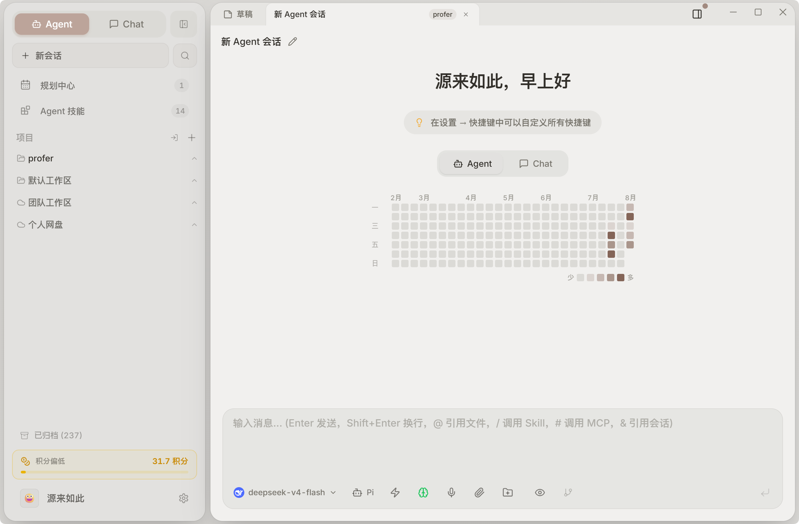

<div align="center">


# Profer

**基于 Claude Agent SDK 的通用 AI Agent 桌面应用**

多模型接入 · 协作子 Agent · 定时任务自动化 · 平板远程接入 · 团队工作区

[](https://github.com/Yuan-lai-ru-ci/ProferAI/releases)
[](./LICENSE)
[](https://www.electronjs.org/)
[](https://github.com/anthropics/claude-agent-sdk)
[](https://www.typescriptlang.org/)
[](https://github.com/Yuan-lai-ru-ci/ProferAI)
[](https://github.com/Yuan-lai-ru-ci/ProferAI/pulls)

</div>

---

Profer 是本地优先（local-first）的 AI 桌面应用：**简单问题用 Chat，复杂任务交给 Agent**。在强大本地 AI Agent 的基础上，叠加了团队协作层——个人工作区 + 团队工作区双模式、Skills 共享市场、文件云端同步、邀请制成员管理。团队知识沉淀在工作区，而不是随对话流失。

---

## ✨ 核心特性

| 特性 | 说明 |
| --- | --- |
| 🤖 **通用 Agent** | 基于 `@anthropic-ai/claude-agent-sdk`，任务图拆解、子任务依赖编排、流式输出、计划确认，支持 **Claude / Pi 双运行时**切换 |
| 🧩 **协作子 Agent** | 复杂任务并行拆分给多个真实子会话独立推进，完成后汇总结果，全程可见可追踪 |
| ⏰ **定时任务自动化** | 持久化调度（interval / daily / weekly / monthly），运行历史、失败保护、结果复盘，适合日报周报、自动检查等无人值守场景 |
| 📱 **平板远程接入** | Capacitor + Android 客户端通过本地 HTTP/WS 远程接入电脑端，平板 Chat、设置同步、断线重连 |
| 👥 **团队工作区** | 邀请制团队（Owner / Admin / Member / Viewer 角色权限），Skills 共享市场、文件云端同步、品牌定制 |
| 💬 **多模型 Chat** | 多供应商对话、附件解析（PDF / Office / 图片）、Markdown / Mermaid / KaTeX / 代码高亮、并排对比、上下文管理 |
| 🧠 **Skills & MCP** | 每工作区独立配置 Skills 与 MCP Server，全屏技能视图支持搜索、启用、更新、导入、卸载与团队发布 |
| 🔌 **远程机器人** | 飞书 / Lark / 钉钉 / 微信桥接，手机或群聊即可触发本机 Agent 工作流 |
| 🎨 **桌面体验** | 自动更新、全局快捷键、快速任务窗口、流式语音输入（豆包）、亮色 / 暗色 / 多款精修主题 |

---

## 📸 界面预览



---

## 🚀 快速开始

### 下载安装

从 [GitHub Releases](https://github.com/Yuan-lai-ru-ci/ProferAI/releases) 下载最新版本，提供 **macOS Apple Silicon / Intel** 与 **Windows** 安装包。

### 首次配置

1. 打开 Profer，完成环境检查（Agent 依赖 Git、Node.js / Bun 及可用 Shell）
2. **设置 → 模型配置**：添加 AI 渠道（Anthropic、DeepSeek、Kimi、智谱、豆包、通义千问等）
3. **设置 → Agent 配置**：选择默认渠道、模型和工作区，即可开始使用

### 配置团队服务器（可选）

团队协作功能需要后端服务（轻量级 Hono + SQLite，可一键部署到任意 Linux 服务器）：

```bash
git clone https://github.com/Yuan-lai-ru-ci/ProferAI.git
cd ProferAI/server
npm install
nohup node index.js > server.log 2>&1 &
```

然后在 Profer 设置 → **品牌定制** 中配置团队服务器地址，即可邀请成员、共享 Skills、云端同步文件。

---

## 🤖 支持的模型渠道

| 供应商 | Chat | Agent | 协议 |
| --- | --- | --- | --- |
| Anthropic | ✅ | ✅ | Messages API |
| DeepSeek | ✅ | ✅ | Anthropic 兼容 |
| Kimi API | ✅ | ✅ | Anthropic 兼容 |
| Kimi Coding Plan | ✅ | ✅ | Anthropic 兼容（官方白名单） |
| OpenAI | ✅ | ❌ | Chat Completions |
| Google | ✅ | ❌ | Gemini API |
| 智谱 AI | ✅ | ✅ | Anthropic 兼容 |
| MiniMax | ✅ | ✅ | Anthropic 兼容 |
| 豆包 | ✅ | ✅ | Anthropic 兼容 |
| 通义千问 | ✅ | ✅ | Anthropic 兼容 |
| 自定义端点 | ✅ | ❌ | OpenAI 兼容 |

---

## 🛠️ 技术栈

| 层级 | 技术 |
| --- | --- |
| 运行时 | Bun |
| 桌面框架 | Electron 43 |
| 前端 | React 18 + TypeScript + Jotai |
| 样式 | Tailwind CSS + Radix UI |
| 富文本 / 图表 | TipTap · Beautiful Mermaid · KaTeX · Shiki |
| 构建 | Vite + esbuild + electron-builder |
| Agent SDK | `@anthropic-ai/claude-agent-sdk@0.3.201` |
| 平板端 | Capacitor（Android） |
| 团队后端 | Hono + better-sqlite3 + JWT |

---

## 👷 本地开发

Bun workspace monorepo：

```text
profer/
├── packages/
│   ├── shared/         # 共享类型、IPC 常量、配置
│   ├── core/           # Provider Adapter、SSE、代码高亮
│   ├── project-core/   # 项目 / 工作区领域模型
│   ├── session-core/   # 会话领域模型
│   └── ui/             # 共享 React UI 组件
├── apps/
│   ├── electron/       # Electron 桌面应用
│   └── cli/            # 命令行工具
├── server/             # 团队同步后端（Hono + SQLite）
└── tablet-app/         # 平板远程客户端（Capacitor Android）
```

```bash
bun install        # 安装依赖
bun run dev        # 开发模式（Vite + Electron + 热重载）
bun run typecheck  # 类型检查
bun test           # 测试
```

---

## 🤝 贡献

欢迎提交 PR！提交前请确认：

- 使用 Bun，不混用 npm / pnpm lockfile
- 状态管理使用 Jotai
- TypeScript 禁用 `any`，对象结构优先使用 `interface`
- 新增 IPC 时同步修改 shared 类型、main handler、preload bridge、renderer 调用
- 影响包行为时递增对应 package 的 patch 版本

---

## 📄 许可证

Profer 基于 [Proma](https://github.com/ErlichLiu/Proma) 开发，社区版采用 [AGPL-3.0](./LICENSE) 协议。

## 🙏 致谢

感谢 [Proma](https://github.com/ErlichLiu/Proma) by Erlich Liu，以及 Shiki、Beautiful Mermaid、Cherry Studio、Lobe Icons、Craft Agents OSS、MemOS 等开源项目。
