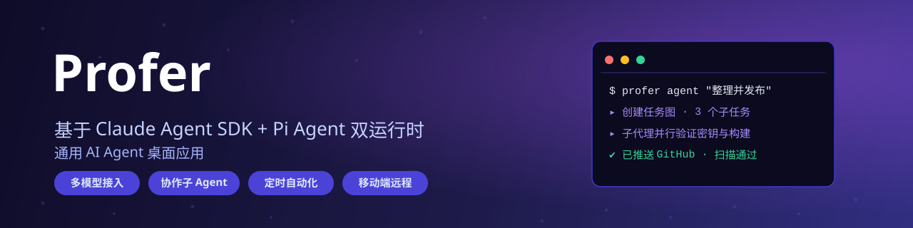
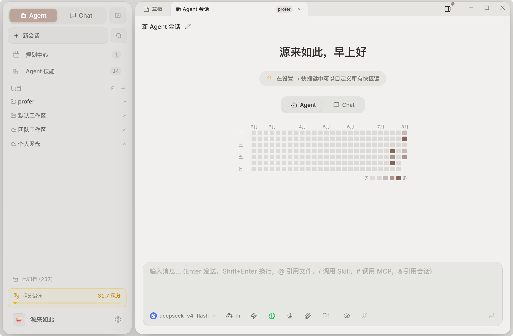

<div align="center">



# Profer

**Your AI workforce in a desktop app**

Built for people who need AI to *do* things, not just chat. Profer runs autonomous agents locally—planning multi-step tasks, coordinating parallel sub-agents, scheduling recurring work—while keeping your data and workflows under your control.

[](https://github.com/Yuan-lai-ru-ci/ProferAI/releases)
[](./LICENSE)
[](https://github.com/Yuan-lai-ru-ci/ProferAI)
[](https://github.com/Yuan-lai-ru-ci/ProferAI/pulls)

[Download for macOS / Windows](https://github.com/Yuan-lai-ru-ci/ProferAI/releases) · [Documentation](./docs) · [Join Community](#community)

</div>

---

## Why Profer?

Most AI tools give you a chatbot. Profer gives you an agent that **executes**, **coordinates**, and **automates**.

- **Chat is for questions.** Agent is for tasks that take hours or require multiple steps.
- **One-shot prompts are brittle.** Profer breaks complex work into dependency graphs and executes them reliably.
- **You shouldn't babysit AI.** Profer runs unattended jobs—daily reports, repo health checks, research pipelines—and reports back when done.

Built on dual runtimes ([Claude Agent SDK](https://github.com/anthropics/claude-agent-sdk) + [Pi Agent SDK](https://www.npmjs.com/package/@earendil-works/pi-agent-core)), Profer balances autonomy with control: agents work independently, but you see their plan before they commit changes, and you own all the data locally.

---

## What makes Profer different

### 🎯 Agent-first, not chat-first

Profer distinguishes simple queries from actual work:

- **Chat mode** for quick questions, brainstorming, document drafts  
- **Agent mode** for multi-step execution: coding, file operations, research synthesis, data pipelines  

Agents break tasks into subtasks with explicit dependencies, execute them in parallel when possible, and surface checkpoints when you need review.

### 🤝 Collaborative sub-agents

Spawn multiple agent sessions for parallel workstreams. Each sub-agent gets its own workspace, full context, and autonomy—you orchestrate at a high level and collect results when they're ready.

**Example:** Analyzing a codebase? Spawn three agents:  
→ Agent A: scan for security issues  
→ Agent B: profile performance bottlenecks  
→ Agent C: extract architecture diagram  

All run concurrently; you review consolidated findings.

### ⏰ Scheduled automation

Set recurring tasks with cron-like schedules (daily / weekly / monthly / interval). Profer executes them unattended and logs:

- Success / failure history  
- Output artifacts (reports, updated files, notifications)  
- Retry logic for transient errors  

**Use cases:**  
→ Generate weekly team status from Git + Jira  
→ Monitor competitor landing pages for changes  
→ Sync research papers to a knowledge base nightly  

### 📱 Mobile companion

Use your phone to trigger desktop agents or review their work. The mobile client (Capacitor-based, separate repo: [Profer-pocket](https://github.com/Yuan-lai-ru-ci/Profer-pocket)) connects over local network or VPN—no cloud relay required.

### 👥 Team workspaces (optional)

Personal use is fully local. For teams:

- Invite-only workspaces with role-based access (Owner / Admin / Member / Viewer)  
- Shared skill library: package reusable prompts, workflows, integrations  
- Cloud sync for files, context, and conversation history  
- Self-hostable backend (lightweight Hono + SQLite)

---

## Demo



*Agent breaking down a task into subtasks, executing file operations, running tests, and awaiting review before final commit.*

---

## Quick start

### 1. Install

Download from [Releases](https://github.com/Yuan-lai-ru-ci/ProferAI/releases):  
- **macOS**: Apple Silicon or Intel DMG  
- **Windows**: 64-bit installer  

Profer checks dependencies on first launch (Git, Node.js or Bun, working shell).

### 2. Connect a model

**Settings → Model Configuration**  

Add one or more providers. Profer supports:

| Provider | Chat | Agent | Notes |
|----------|------|-------|-------|
| Anthropic | ✅ | ✅ | Native Claude Messages API |
| DeepSeek | ✅ | ✅ | Anthropic-compatible |
| Kimi (Moonshot) | ✅ | ✅ | Anthropic-compatible |
| OpenAI | ✅ | ❌ | Chat only, no agentic tool use |
| Google Gemini | ✅ | ❌ | Chat only |
| 智谱 AI | ✅ | ✅ | Anthropic-compatible |
| MiniMax | ✅ | ✅ | Anthropic-compatible |
| 豆包 (Doubao) | ✅ | ✅ | Anthropic-compatible |
| 通义千问 (Qwen) | ✅ | ✅ | Anthropic-compatible |
| Custom endpoint | ✅ | ❌ | OpenAI-compatible API |

### 3. Start working

- **Chat**: Quick conversations, brainstorming, document editing  
- **Agent**: Complex tasks—coding, file batch operations, research synthesis  

Agents show you their execution plan before making irreversible changes.

---

## Use cases

### For developers

- **Codebase refactoring**: "Extract all API calls into a service layer, update tests"  
- **Dependency audits**: "List all outdated packages, check for security advisories, propose upgrade plan"  
- **Documentation generation**: "Scan `/src`, extract public APIs, write OpenAPI spec + usage examples"  

### For researchers

- **Literature review**: "Find papers on X published after 2023, extract methodology and datasets, summarize in a table"  
- **Data pipeline**: "Download dataset from Y, clean missing values, run correlation analysis, generate report with plots"  

### For teams

- **Recurring reports**: Schedule weekly summary of merged PRs, open issues, and release notes  
- **Monitoring**: Daily check of competitor pricing pages; alert on changes  
- **Knowledge sync**: Nightly sync of new Slack threads, Notion pages, or Confluence docs into a unified knowledge base  

---

## Architecture

Profer is a **local-first Electron app** with optional cloud layer for teams.

```text
┌─────────────────────────────────────────────────────────┐
│                     Profer Desktop                       │
│  ┌─────────────────────────────────────────────────┐   │
│  │  Agent Runtime (Claude SDK + Pi SDK)            │   │
│  │  ├─ Task graph orchestration                    │   │
│  │  ├─ Parallel sub-agent spawning                 │   │
│  │  ├─ MCP server integration                      │   │
│  │  └─ Skill execution (workspace-scoped)          │   │
│  └─────────────────────────────────────────────────┘   │
│  ┌─────────────────────────────────────────────────┐   │
│  │  Chat & Workspace UI (React + Jotai)            │   │
│  └─────────────────────────────────────────────────┘   │
│  ┌─────────────────────────────────────────────────┐   │
│  │  Local Storage (SQLite + filesystem)            │   │
│  └─────────────────────────────────────────────────┘   │
└─────────────────────────────────────────────────────────┘
                        ↕ (optional)
┌─────────────────────────────────────────────────────────┐
│  Team Sync Backend (Hono + SQLite + JWT)               │
│  ├─ Workspace sharing                                   │
│  ├─ Skill marketplace                                   │
│  └─ File sync                                           │
└─────────────────────────────────────────────────────────┘
                        ↕ (local network / VPN)
┌─────────────────────────────────────────────────────────┐
│  Mobile Client (Capacitor + React)                      │
│  └─ Chat, review agent results, trigger tasks           │
└─────────────────────────────────────────────────────────┘
```

### Tech stack

- **Runtime**: Bun  
- **Desktop**: Electron 43  
- **Frontend**: React 18 + TypeScript + Jotai state  
- **UI**: Tailwind CSS + Radix primitives  
- **Rich content**: TipTap editor, Beautiful Mermaid, KaTeX math, Shiki syntax highlighting  
- **Agent SDKs**:  
  - [`@anthropic-ai/claude-agent-sdk@0.3.201`](https://github.com/anthropics/claude-agent-sdk)  
  - [`@earendil-works/pi-agent@0.82.1`](https://www.npmjs.com/package/@earendil-works/pi-agent-core)  
- **Mobile**: Capacitor (Android client in [Profer-pocket repo](https://github.com/Yuan-lai-ru-ci/Profer-pocket))  
- **Team backend**: Hono + better-sqlite3 + JWT  

---

## Development

Profer is a Bun workspace monorepo:

```text
profer/
├── packages/
│   ├── shared/         # Shared types, IPC contracts, config
│   ├── core/           # Provider adapters, SSE, syntax highlighting
│   ├── project-core/   # Project / workspace domain
│   ├── session-core/   # Session domain
│   └── ui/             # Shared React components
├── apps/
│   ├── electron/       # Electron desktop app
│   └── cli/            # CLI tools
└── server/             # Team sync backend (Hono + SQLite)
```

### Setup

```bash
bun install        # Install dependencies
bun run dev        # Development mode (Vite + Electron hot reload)
bun run typecheck  # Type check all packages
bun test           # Run tests
```

### Build for production

```bash
bun run build:mac       # macOS universal binary
bun run build:win       # Windows installer
```

Artifacts appear in `apps/electron/dist`.

### Contributing

We welcome PRs! Before submitting:

- Use **Bun** (no npm/pnpm lockfiles)  
- State management via **Jotai**  
- No `any` in TypeScript; prefer `interface` over `type` for object shapes  
- New IPC: update types in `shared/`, handler in `main/`, preload bridge, and renderer call  
- Bump patch version in affected `package.json` when changing package behavior  

See [CONTRIBUTING.md](./CONTRIBUTING.md) for detailed guidelines.

---

## Self-hosting team backend (optional)

For team collaboration features, deploy the lightweight backend:

```bash
git clone https://github.com/Yuan-lai-ru-ci/ProferAI.git
cd ProferAI/server
npm install
node index.js
```

Default port: `3000`. Use a reverse proxy (nginx / Caddy) for HTTPS in production.

Configure team server URL in **Profer → Settings → Branding**.

---

## Community

- **GitHub Discussions**: [Ask questions, share workflows](https://github.com/Yuan-lai-ru-ci/ProferAI/discussions)  
- **Issues**: [Report bugs, request features](https://github.com/Yuan-lai-ru-ci/ProferAI/issues)  
- **PRs**: [Contribute code, docs, skills](https://github.com/Yuan-lai-ru-ci/ProferAI/pulls)  

---

## Roadmap

- [ ] Windows ARM64 support  
- [ ] Linux AppImage / Flatpak  
- [ ] Plugin API for third-party integrations  
- [ ] Built-in vector DB for semantic search over workspace context  
- [ ] iOS client  
- [ ] Web version (WebAssembly agent runtime)  

See [open issues](https://github.com/Yuan-lai-ru-ci/ProferAI/issues) for detailed plans and vote on what matters to you.

---

## License

Profer is built on [Proma](https://github.com/ErlichLiu/Proma) and licensed under [AGPL-3.0](./LICENSE).  

Commercial licensing available for teams needing proprietary forks—contact us via Issues.

---

## Credits

Built with:

- [Proma](https://github.com/ErlichLiu/Proma) by Erlich Liu  
- [Claude Agent SDK](https://github.com/anthropics/claude-agent-sdk) by Anthropic  
- [Pi Agent SDK](https://www.npmjs.com/package/@earendil-works/pi-agent-core) by Earendil Works  
- [Shiki](https://shiki.style/), [Beautiful Mermaid](https://www.npmjs.com/package/@cuhery/beautiful-mermaid), [Cherry Studio](https://github.com/kangfenmao/cherry-studio), [Lobe Icons](https://lobehub.com/icons)  

---

<div align="center">

**[⬇️ Download Profer](https://github.com/Yuan-lai-ru-ci/ProferAI/releases)** · **[📖 Read the docs](./docs)** · **[⭐ Star this repo](https://github.com/Yuan-lai-ru-ci/ProferAI)**

Made with ❤️ by the Profer team

</div>
