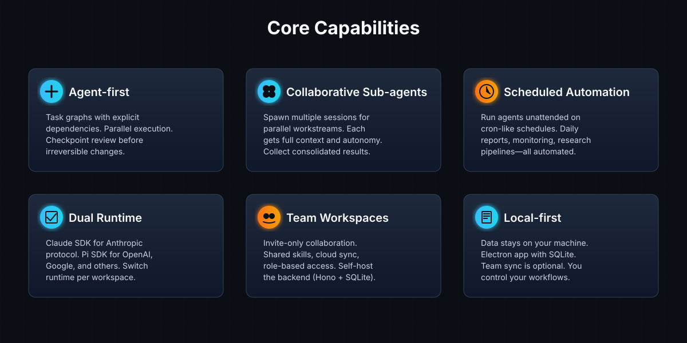
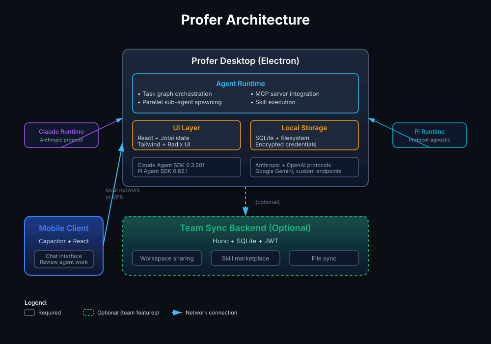
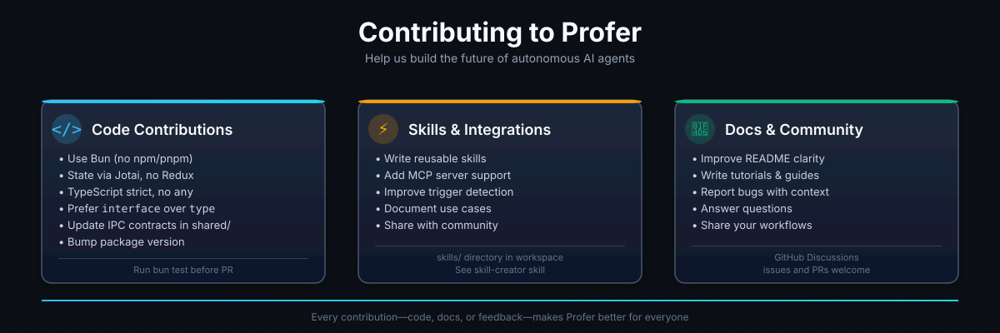

<div align="center">


# Profer

**你的桌面 AI 工作台**

为需要 AI **执行任务**而非仅仅聊天的人而建。Profer 在本地运行自主 Agent——规划多步骤任务、协调并行子 Agent、调度重复性工作——同时让你的数据和工作流保持在自己掌控之中。

[](https://github.com/Yuan-lai-ru-ci/ProferAI/releases)
[](./LICENSE)
[](https://github.com/Yuan-lai-ru-ci/ProferAI)
[](https://github.com/Yuan-lai-ru-ci/ProferAI/pulls)

[下载 macOS / Windows 版本](https://github.com/Yuan-lai-ru-ci/ProferAI/releases) · [文档](./docs) · [加入社区](#community)

[English](./README.md) | 简体中文

</div>

---

## 为什么选择 Profer？

大多数 AI 工具给你一个聊天机器人。Profer 给你一个能够**执行**、**协调**和**自动化**的 Agent。

- **Chat 用于提问。** Agent 用于需要数小时或多个步骤的任务。
- **单次提示词很脆弱。** Profer 将复杂工作分解为依赖图并可靠地执行它们。
- **你不应该一直盯着 AI。** Profer 运行无人值守任务——日报、仓库健康检查、研究流水线——完成后再报告。

基于双运行时（[Claude Agent SDK](https://github.com/anthropics/claude-agent-sdk) + [Pi Agent SDK](https://www.npmjs.com/package/@earendil-works/pi-agent-core)），Profer 在自主性和控制之间取得平衡：Agent 独立工作，但在提交更改前你能看到它们的计划，而且所有数据都在本地。

---



---

## Profer 的独特之处

### 🎯 Agent 优先，而非聊天优先

Profer 区分简单查询和实际工作：

- **Chat 模式** 用于快速问题、头脑风暴、文档草稿
- **Agent 模式** 用于多步骤执行：编码、文件操作、研究综合、数据管道

Agent 将任务分解为带有明确依赖关系的子任务，在可能时并行执行它们，并在需要审查时提供检查点。

### 🤝 协作式子 Agent

为并行工作流生成多个 Agent 会话。每个子 Agent 获得自己的工作区、完整上下文和自主权——你在高层次编排并在准备就绪时收集结果。

**示例：** 分析代码库？生成三个 Agent：
→ Agent A：扫描安全问题
→ Agent B：分析性能瓶颈
→ Agent C：提取架构图

全部并发运行；你审查汇总后的发现。

### ⏰ 定时自动化

使用类似 cron 的调度设置重复任务（每天/每周/每月/间隔）。Profer 无人值守地执行它们并记录：

- 成功/失败历史
- 输出产物（报告、更新的文件、通知）
- 临时错误的重试逻辑

**使用场景：**
→ 从 Git + Jira 生成每周团队状态
→ 监控竞品落地页的变化
→ 每晚同步研究论文到知识库

### 📱 移动端伴侣

使用手机触发桌面 Agent 或审查它们的工作。移动客户端（基于 Capacitor，独立仓库：[Profer-pocket](https://github.com/Yuan-lai-ru-ci/Profer-pocket)）通过本地网络或 VPN 连接——无需云端中继。

### 👥 团队工作区（可选）

个人使用完全本地化。对于团队：

- 仅邀请的工作区，带基于角色的访问控制（Owner / Admin / Member / Viewer）
- 共享技能库：打包可复用的提示词、工作流、集成
- 文件、上下文和对话历史的云同步
- 可自托管的后端（轻量级 Hono + SQLite）

---

## 演示


*Agent 将任务分解为子任务，执行文件操作，运行测试，并在最终提交前等待审查。*

---

## 快速开始

### 1. 安装

从 [Releases](https://github.com/Yuan-lai-ru-ci/ProferAI/releases) 下载：

- **macOS:** `Profer-x.y.z-mac-universal.dmg`（Intel + Apple Silicon）
- **Windows:** `Profer-x.y.z-win-x64-setup.exe`

### 2. 配置模型

启动 Profer → **设置** → **模型配置**

#### Chat 模式（所有供应商）

| 供应商 | 配置项 | 说明 |
|--------|--------|------|
| **Anthropic** | API Key | Claude 3.5 Sonnet, Claude 3 Opus 等 |
| **OpenAI** | API Key + Base URL（可选）| GPT-4, GPT-4 Turbo 等 |
| **Google** | API Key | Gemini 1.5 Pro, Gemini 2.0 Flash 等 |
| **DeepSeek** | API Key | DeepSeek V3 等 |
| **Kimi** | API Key | Moonshot 模型 |
| **智谱 (Zhipu)** | API Key | GLM-4, CodeGeex 等 |
| **豆包 (Doubao)** | API Key + Endpoint ID | 字节跳动模型 |
| **通义千问 (Qwen)** | API Key | 阿里云模型 |
| **MiniMax** | API Key + Group ID | MiniMax 模型 |
| **xAI** | API Key | Grok 系列 |
| **Ollama** | Base URL | 本地模型（需先安装 Ollama）|

#### Agent 模式支持

| 供应商 | Pi Runtime | Claude Runtime | 备注 |
|--------|-----------|----------------|------|
| Anthropic | ✅ | ✅ | 完整双运行时支持 |
| OpenAI | ✅ | ❌ | 仅 Pi runtime（协议不兼容）|
| Google | ✅ | ❌ | 仅 Pi runtime |
| DeepSeek | ✅ | ✅ | 支持 Anthropic 协议 |
| Kimi | ✅ | ✅ | 支持 Anthropic 协议 |
| 智谱 Coding | ✅ | ✅ | CodeGeex 支持 Anthropic 协议 |
| 豆包 | ✅ | ❌ | 仅 Pi runtime |
| 通义千问 | ✅ | ❌ | 仅 Pi runtime |
| MiniMax | ✅ | ✅ | 支持 Anthropic 协议 |
| xAI/Grok | ✅ | ❌ | 仅 Pi runtime |
| Ollama | ✅ | ✅ | 取决于模型协议支持 |

**说明：**
- **Pi Runtime**: 协议无关，支持所有供应商
- **Claude Runtime**: 仅支持 Anthropic 协议兼容的供应商
- 推荐使用双运行时支持的供应商以获得最佳灵活性

### 3. 创建工作区

**工作区** = 隔离的环境，带独立的会话历史、技能库和配置。

```
设置 → 工作区 → 新建工作区
```

为不同项目/客户端/实验使用独立工作区。

### 4. 运行你的第一个 Agent

切换到 **Agent 模式** → 描述任务：

```
分析 /path/to/repo 的 TypeScript 代码质量。
检查：
- 未使用的导入和变量
- 过于复杂的函数（圈复杂度 > 10）
- 缺少错误处理
- 代码重复模式

生成带建议优先级的 markdown 报告。
```

Agent 将：
1. 扫描仓库
2. 分析代码模式
3. 生成报告
4. 在需要时请求你的审查

---

## 架构

Profer 是一个**本地优先的 Electron 应用**，带团队可选的云层。



### 技术栈

**桌面端（Electron）**
- **Agent Runtime**: 
  - [Claude Agent SDK 0.3.201](https://github.com/anthropics/claude-agent-sdk)
  - [Pi Agent SDK 0.82.1](https://www.npmjs.com/package/@earendil-works/pi-agent-core)
  - 任务图编排、子 Agent 生成、MCP 集成
- **前端**: React 18 + TypeScript + Jotai（状态）+ Tailwind + Radix UI
- **存储**: SQLite（会话、配置）+ 文件系统（工作区）
- **IPC**: 类型安全的渲染器 ↔ 主进程通信

**后端（可选，团队功能）**
- **框架**: Hono（快速边缘运行时）
- **数据库**: SQLite（轻量级，可移植）
- **认证**: JWT + 基于角色的访问控制
- **功能**: 工作区共享、技能市场、文件同步

**移动端（Capacitor + React）**
- 触发桌面 Agent
- 审查结果并继续对话
- 通过本地网络/VPN 连接（无云依赖）

---

## 多模型支持

Profer 支持多家 AI 供应商：

### 主流供应商

| 供应商 | 支持模型 | Chat | Agent |
|--------|----------|------|-------|
| **Anthropic** | Claude 3.5 Sonnet, Claude 3 Opus, Claude 3 Haiku | ✅ | ✅ (双运行时) |
| **OpenAI** | GPT-4, GPT-4 Turbo, GPT-4o, o1-preview, o1-mini | ✅ | ✅ (仅 Pi) |
| **Google** | Gemini 1.5 Pro, Gemini 2.0 Flash (exp), Gemini 1.5 Flash | ✅ | ✅ (仅 Pi) |
| **DeepSeek** | DeepSeek V3, DeepSeek Coder V2 | ✅ | ✅ (双运行时) |

### 中国大陆供应商

| 供应商 | 支持模型 | Chat | Agent |
|--------|----------|------|-------|
| **Kimi (月之暗面)** | Moonshot v1 (128k-320k) | ✅ | ✅ (双运行时) |
| **智谱 (Zhipu AI)** | GLM-4, GLM-4-Plus, GLM-4V, CodeGeex-4 | ✅ | ✅ (Coding 双运行时) |
| **豆包 (字节跳动)** | 豆包系列模型 | ✅ | ✅ (仅 Pi) |
| **通义千问 (阿里云)** | Qwen-Max, Qwen-Plus, Qwen-Turbo, Qwen-VL | ✅ | ✅ (仅 Pi) |
| **MiniMax** | MiniMax 系列 | ✅ | ✅ (双运行时) |

### 本地/自托管

| 供应商 | 说明 | Chat | Agent |
|--------|------|------|-------|
| **Ollama** | 本地运行开源模型（Llama, Mistral 等）| ✅ | ✅ (取决于模型) |
| **自定义端点** | 任何 OpenAI 兼容 API | ✅ | ✅ (仅 Pi) |

**配置 Ollama:**
```bash
# 安装 Ollama（macOS/Linux）
curl -fsSL https://ollama.com/install.sh | sh

# 拉取模型
ollama pull llama3.1

# Profer 设置
Base URL: http://localhost:11434
Model: llama3.1
```

---

## 核心功能

### 1. 任务图编排

Profer 将复杂任务分解为带依赖关系的 DAG（有向无环图）：

```
用户任务: "重构认证流程"
  ↓
Agent 计划:
  ┌─ 任务 A: 审计当前实现 ────┐
  ├─ 任务 B: 设计新架构 ───────┤
  └─ 任务 C: 写入测试用例 ─────┤
                            ↓
  ┌─ 任务 D: 实现新认证 ←─────┘
  └─ 任务 E: 迁移现有用户
```

Agent 并行执行 A/B/C，只有在它们完成后才开始 D。

### 2. 技能（Skills）

**技能** = 可复用的提示词模板 + 工作流逻辑，存储在工作区中。

**内置技能：**
- `code-review`: 深度代码审查，带安全/性能/可维护性检查
- `research-synthesis`: 从多个来源综合发现
- `doc-generator`: 从代码库生成 API 文档
- `test-writer`: 为现有函数生成单元测试

**创建自定义技能：**
```markdown
# skills/my-skill/SKILL.md

## 触发器
当用户说"优化 SQL 查询"时触发

## 行为
1. 识别仓库中的所有 SQL 查询
2. 运行 EXPLAIN ANALYZE
3. 建议索引/查询重写
4. 基准测试改进前后
```

安装到：`<workspace>/.profer/skills/`

### 3. MCP 集成

Profer 支持 [Model Context Protocol](https://modelcontextprotocol.io) 用于工具扩展。

**配置 MCP 服务器：**
```json
// <workspace>/mcp.json
{
  "servers": {
    "filesystem": {
      "command": "npx",
      "args": ["-y", "@modelcontextprotocol/server-filesystem", "/path/to/allowed"]
    },
    "postgres": {
      "command": "npx",
      "args": ["-y", "@modelcontextprotocol/server-postgres", "postgresql://..."]
    }
  }
}
```

Agent 自动发现并使用这些工具。

### 4. 上下文管理

Profer 跨执行步骤维护上下文：

- **工作区资料**: 项目背景、偏好、约定
- **会话记忆**: 跨任务的长期事实
- **执行日志**: 每个子任务的完整可审计轨迹

无需在每次提示中重复上下文——Agent 记住。

---

## 使用场景

### 开发者

- **代码审查自动化**: 生成 Agent 在每次 PR 时扫描安全漏洞、性能回归和风格违规
- **测试生成**: 为现有函数/组件编写单元测试
- **重构助手**: 建议并应用代码改进（提取函数、移除重复、现代化模式）
- **文档同步**: 在代码更改时保持 README/API 文档更新

### 研究者

- **文献综述**: 抓取论文，提取关键发现，综合跨研究的主题
- **数据管道**: 设置从多个来源（APIs、数据库、文件）获取、清理和聚合的重复任务
- **实验日志**: 自动记录实验参数、结果和统计显著性
- **知识库维护**: 组织笔记、标记概念、建议相关阅读

### 团队与生产力

- **状态报告**: 从 Git 提交 + Jira ticket + Slack 线程生成每周摘要
- **竞争监控**: 每天抓取竞品落地页/定价页，差异高亮
- **客户入职**: 自动生成个性化的入职文档/演示/培训材料
- **合规审计**: 定期扫描代码库以确保符合 GDPR/HIPAA/SOC2 要求

---

## 贡献



我们欢迎 PR！提交前请：

1. **使用 Bun**（不是 npm/pnpm）安装依赖
   ```bash
   bun install
   ```

2. **遵循代码规范**
   - 通过 Jotai 管理状态，不使用 Redux
   - TypeScript strict 模式，避免 `any`
   - 优先使用 `interface` 而非 `type`
   - 在 `packages/shared/` 中更新 IPC 合约

3. **递增版本**
   - 更新 `apps/electron/package.json` 中的版本
   - 如果更改了 IPC 合约，递增 `packages/shared/package.json`

4. **运行测试**
   ```bash
   bun test
   ```

5. **提交信息格式**
   ```
   feat(scope): 添加功能 X
   fix(scope): 修复问题 Y
   docs: 更新 README
   ```

### 需要改进的地方

- [ ] Windows 上的文件监视器性能
- [ ] 更好的移动端 UI（当前最小化）
- [ ] 更多内置技能（SEO 审计、可访问性检查器、翻译工作流）
- [ ] 插件市场（社区提交的技能/MCP 服务器）
- [ ] 导出/导入工作区以便移植

---

## 路线图

**v0.17 (2025 Q2)**
- [ ] 插件市场 UI
- [ ] 增强的任务图可视化（Mermaid 导出）
- [ ] Windows ARM64 支持

**v0.18 (2025 Q3)**
- [ ] Web 版本（在浏览器中运行 Agent，无 Electron）
- [ ] VS Code 扩展（在编辑器中触发 Profer Agent）
- [ ] 与 Slack/Discord/Teams 的 Webhook 集成

**v1.0 (2025 Q4)**
- [ ] 生产就绪的团队后端
- [ ] 企业 SSO（SAML/OIDC）
- [ ] 基于使用量的审计日志和计费

查看 [GitHub Projects](https://github.com/Yuan-lai-ru-ci/ProferAI/projects) 获取详细的里程碑。

---

## 社区

- **GitHub Discussions**: [问答、功能请求、展示你的工作流](https://github.com/Yuan-lai-ru-ci/ProferAI/discussions)
- **Issues**: [报告 bug 或建议改进](https://github.com/Yuan-lai-ru-ci/ProferAI/issues)
- **Pull Requests**: [贡献代码、文档或技能](https://github.com/Yuan-lai-ru-ci/ProferAI/pulls)

---

## 许可证

[MIT License](./LICENSE)

---

## 致谢

Profer 基于以下优秀项目构建：

- [Claude Agent SDK](https://github.com/anthropics/claude-agent-sdk) by Anthropic
- [Pi Agent SDK](https://www.npmjs.com/package/@earendil-works/pi-agent-core) by Earendil Works
- [Model Context Protocol](https://modelcontextprotocol.io) by Anthropic
- [Electron](https://www.electronjs.org) 跨平台桌面框架
- [Bun](https://bun.sh) 快速的 JavaScript 运行时和包管理器
- [React](https://react.dev), [Jotai](https://jotai.org), [Tailwind CSS](https://tailwindcss.com), [Radix UI](https://www.radix-ui.com)

特别感谢所有贡献者和早期采用者的反馈！

---

<div align="center">

**用 Profer 构建？** [在 Discussions 中分享你的工作流](https://github.com/Yuan-lai-ru-ci/ProferAI/discussions) 🚀

</div>
